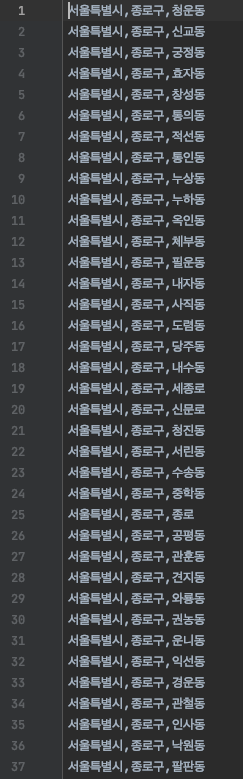
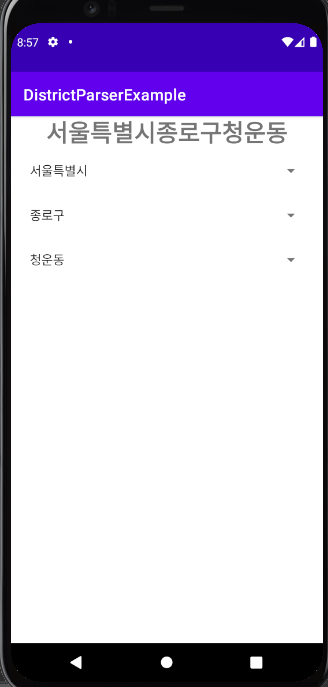

|**분류**|**내용**|
| :-: | :-: |
|목표|Android 에서 Spinner를 사용하여 사용자의 주소를 선택하도록 유도할 때 각각의 Spinner에는 행정구역 데이터가 필요하다. 행정구역 데이터는 총 만개가 넘는 데이터로 일일이 작성할 수 없어 파이썬을 이용해 먼저 Spinner에 적용하기 적합한 형태로 데이터를 파싱한 후 안드로이드에서 각각의 Spinner에 데이터를 적용한다.|
|파이썬으로 생성한 txt파일||
|동작||

