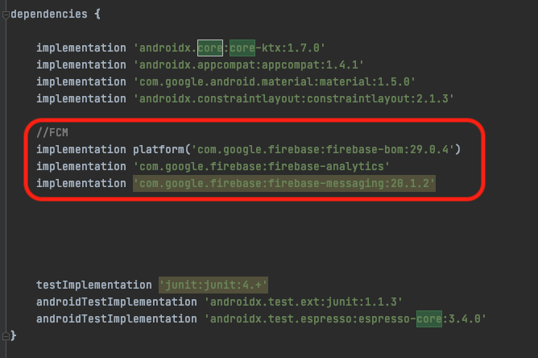

|**분류**|**내용**|
| :-: | :-: |
|Build.gradle:project||
|Build.gradle:app|

|
|Manifest||
|
Firebase Console Messaging

1
||
|
Firebase Console Messaging

2
||
|
Firebase Console Messaging

3
||
|
Firebase Console Messaging

4
||
|
Firebase Console Messaging

5
||
|결과||

