|**분류**|**내용**|
| :-: | :-: |
|Build.gradle:project|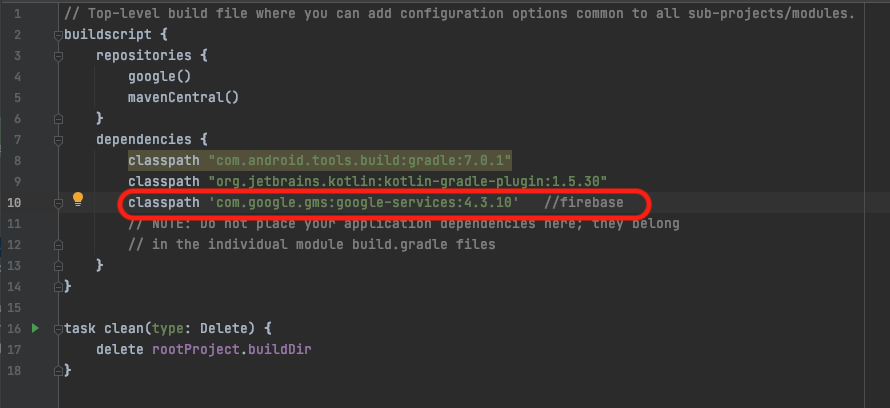|
|Build.gradle:app|
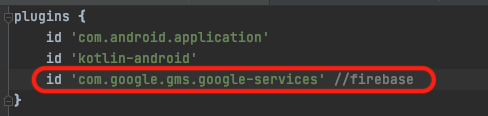

|
|Manifest|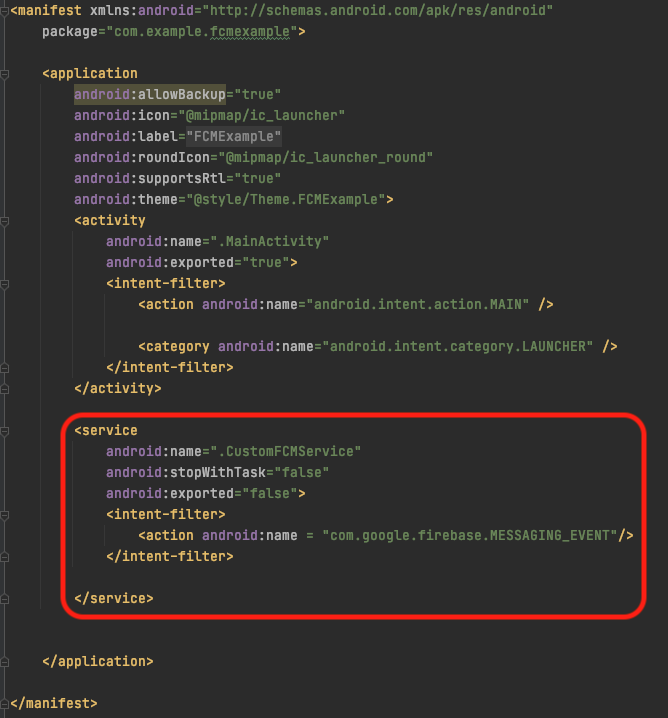|
|
Firebase Console Messaging

1
|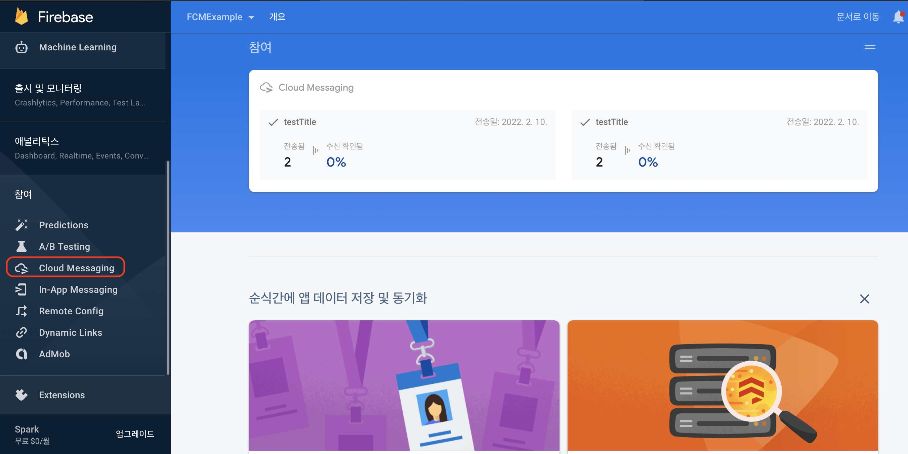|
|
Firebase Console Messaging

2
|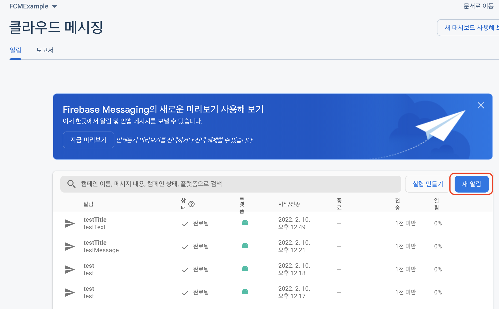|
|
Firebase Console Messaging

3
|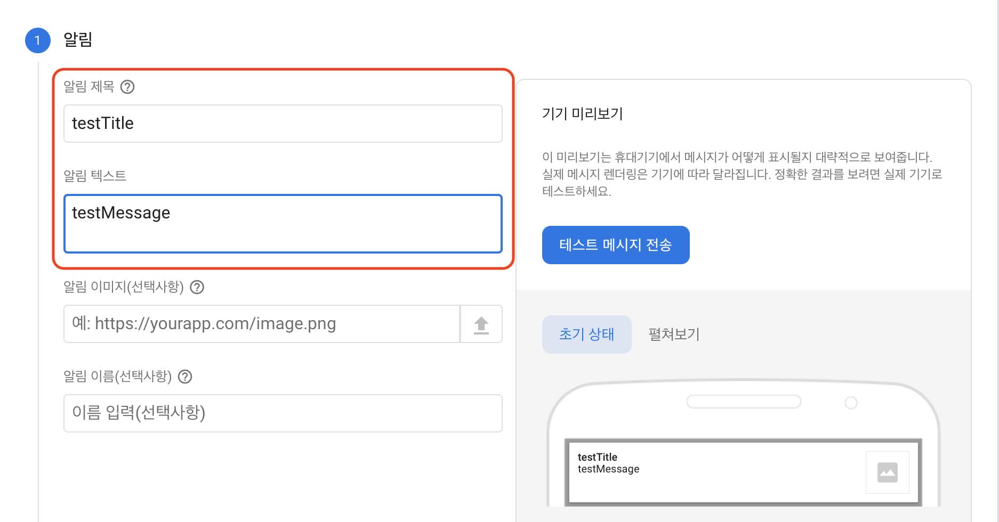|
|
Firebase Console Messaging

4
|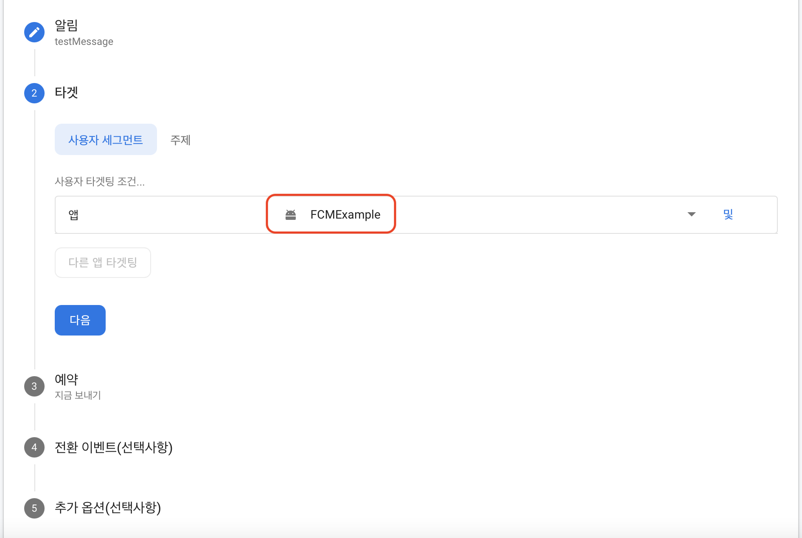|
|
Firebase Console Messaging

5
|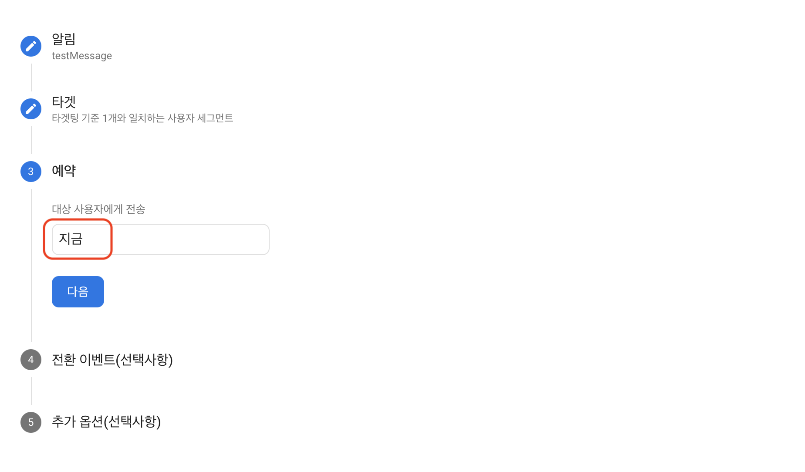|
|결과|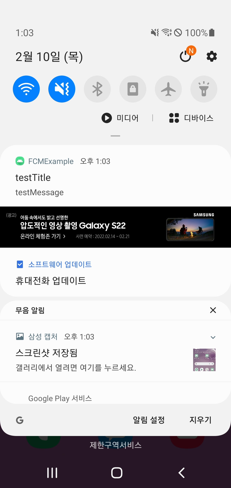|
|getToken|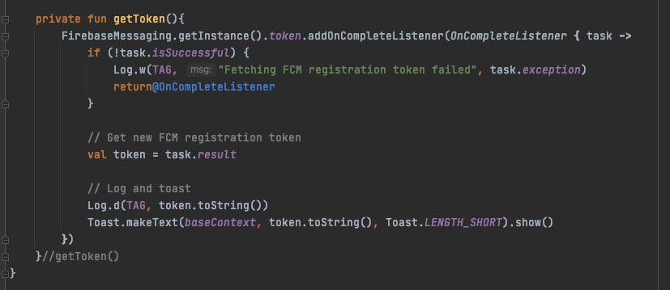|
|특정 기기로 전송|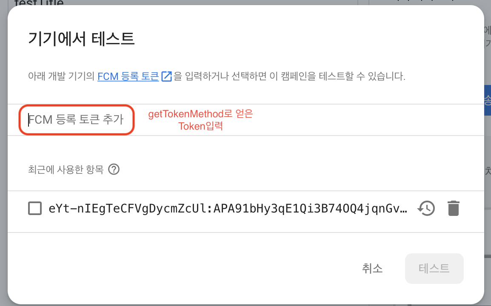|
|특정 기기로 전송|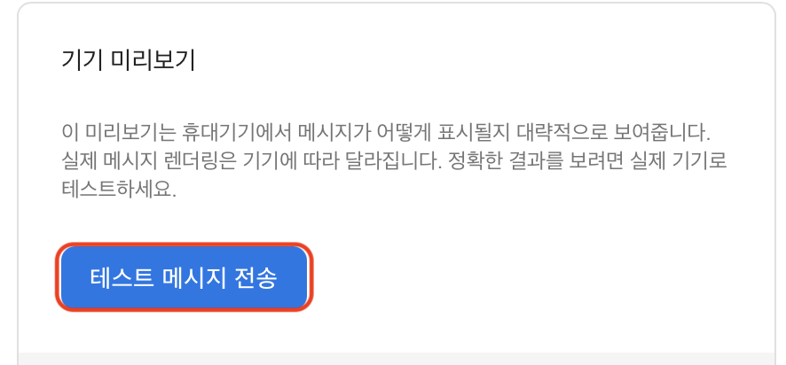|

