|**분류**|**내용**|
| :-: | :-: |
|목표|Android Client에서 Spring Boot Server로 요청을 보낸다. 요청은 두가지로 첫 째는 토큰없이 Post요청을 보낸다. 두 번째는 token인증을 요구하는 요청으로 PostMan에서 테스트를 통해 발급받은 토큰을 이용하는것으로 한다. |
|
API TEST

(Server -  Controller)
|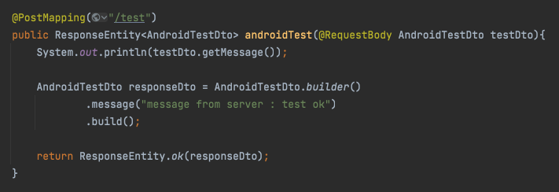|
|
API TEST

(Android Retrofit2)
|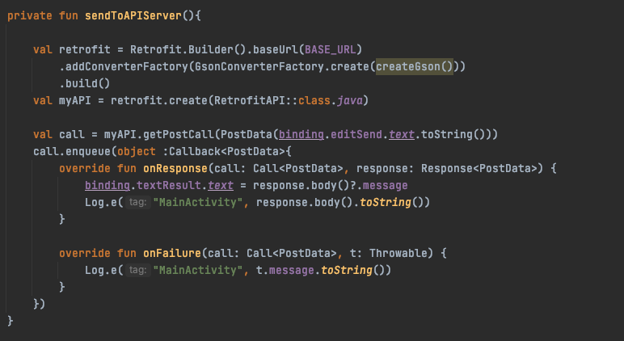|
|
API TEST

(결과 - Server)
|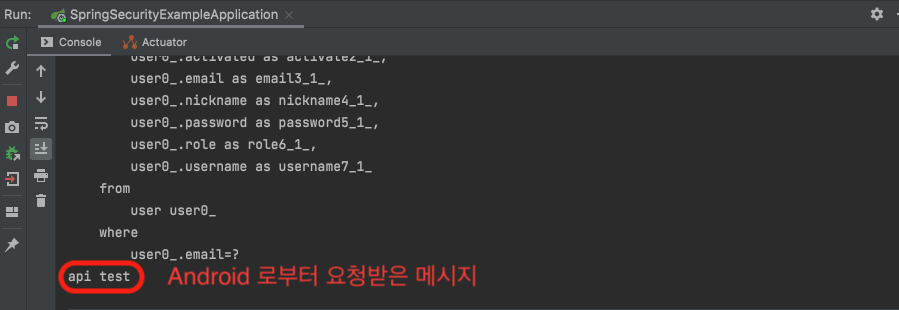|
|
API TEST

(결과 – Android)
|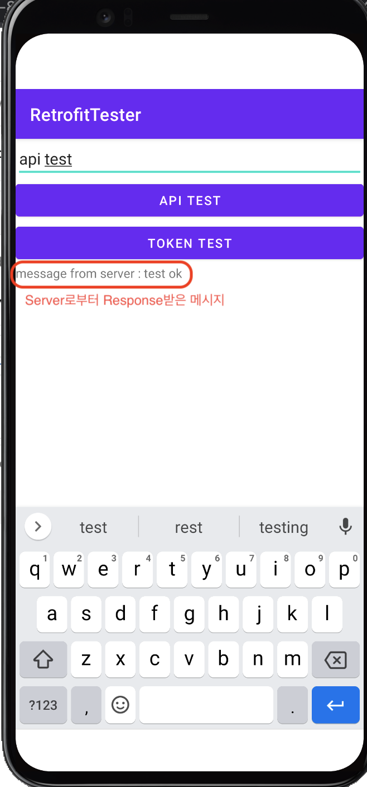|
|
Token Test

(Server – Controller)
|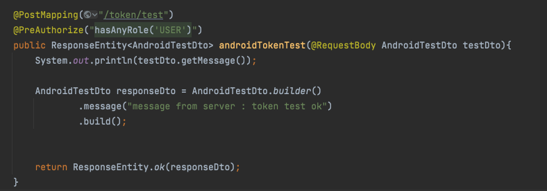|
|
Token Test 

(Android – Okhhtp client)
|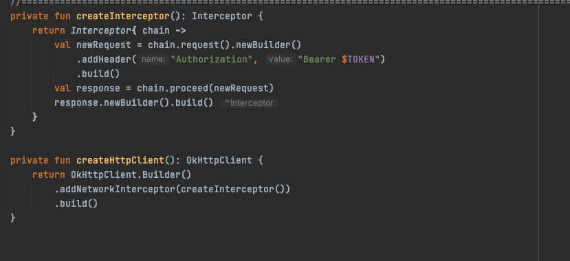|
|
Token Test

(Android – retrofit2)
|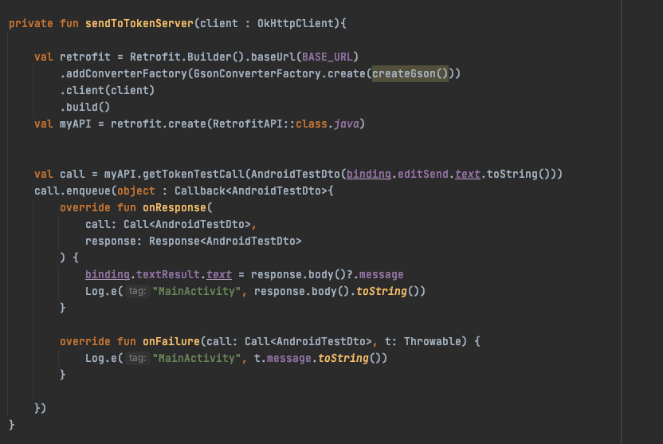|
|
Postman

(회원가입)
|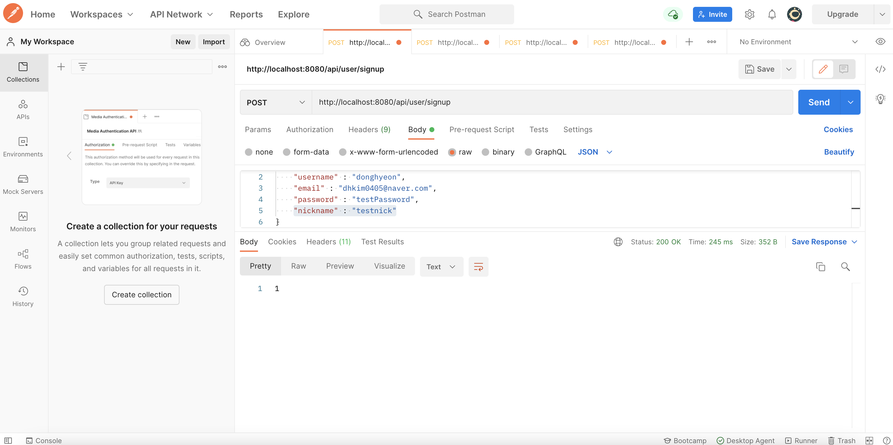|
|
H2 – console

(회원 테이블)
|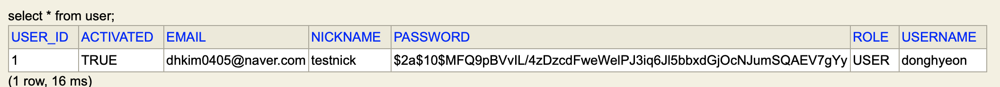|
|
Postman

(로그인 – 토큰 발급)
|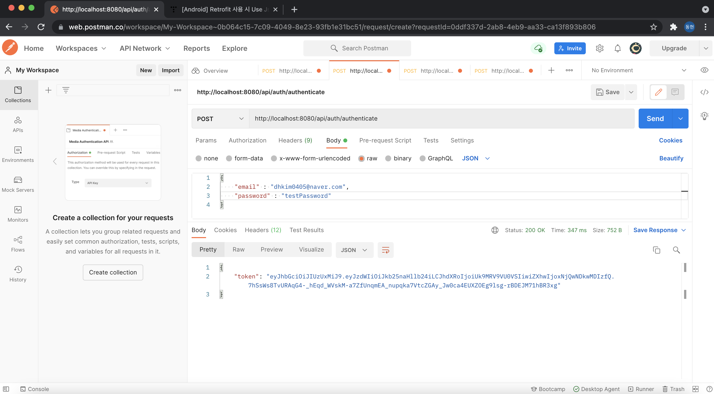|
|
Token Test

(결과 – Server)
|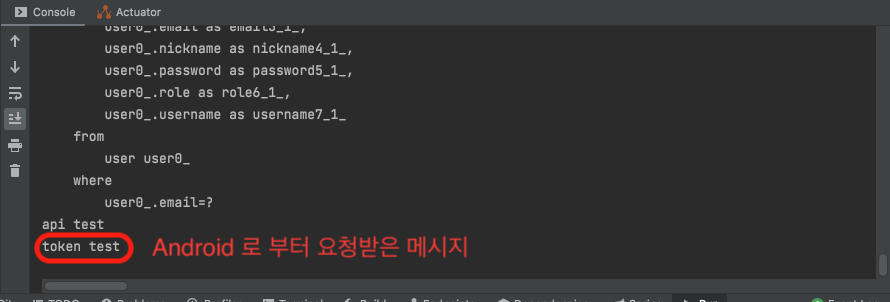|
|
Token Test

(결과 – Android)
|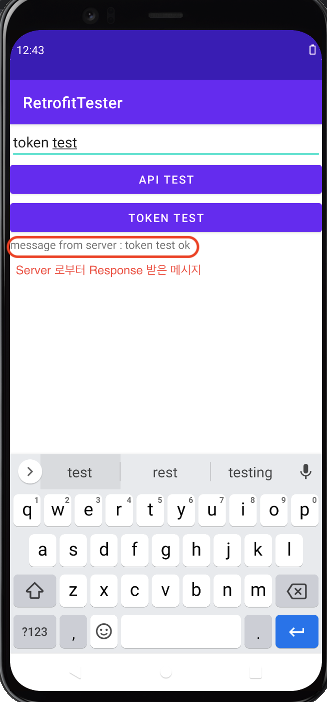|

